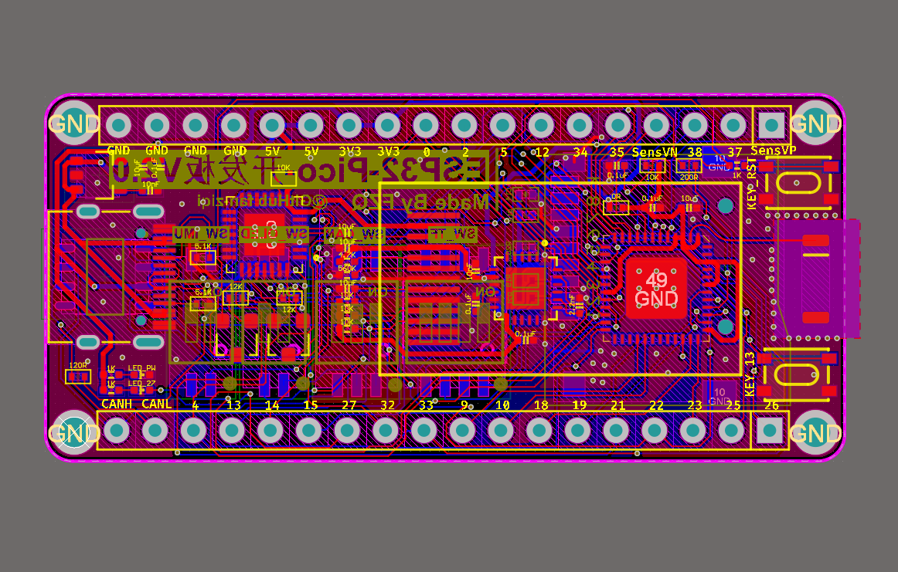

# ESP32-Main
 基于稚晖君版本改进的ESP32开发板

ESP32，便宜，真的便宜！才十几块钱一片！

ST系列的MCU价格真的贵到离谱，F103ZET6现在都好几百一块了。

引用稚晖君的描述：

> 实际上ESP32性能比STM32还强不少：
>
> * 双核架构，主频还高
> * 带WiFi/蓝牙能力（SiP封装内带射频匹配电路）
> * 原生基于FreeRTOS
> * 直接兼容Arduino生态
> * GPIO-Matrix（神器，GPIO互换，PCB Layout友好度拉满）
> * 接口丰富（3个UART、2个I2C、2个SPI、**居然还带CAN**）
> * SiP封装，外围电路极其简洁

程序还是先咕咕了，最近期末考试再加上课设没有空写这个了

2021.06.28

@Github fan-ziqi